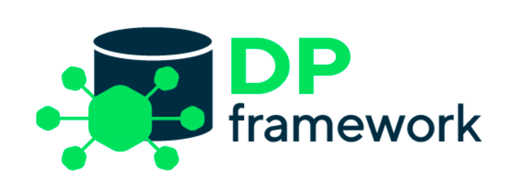
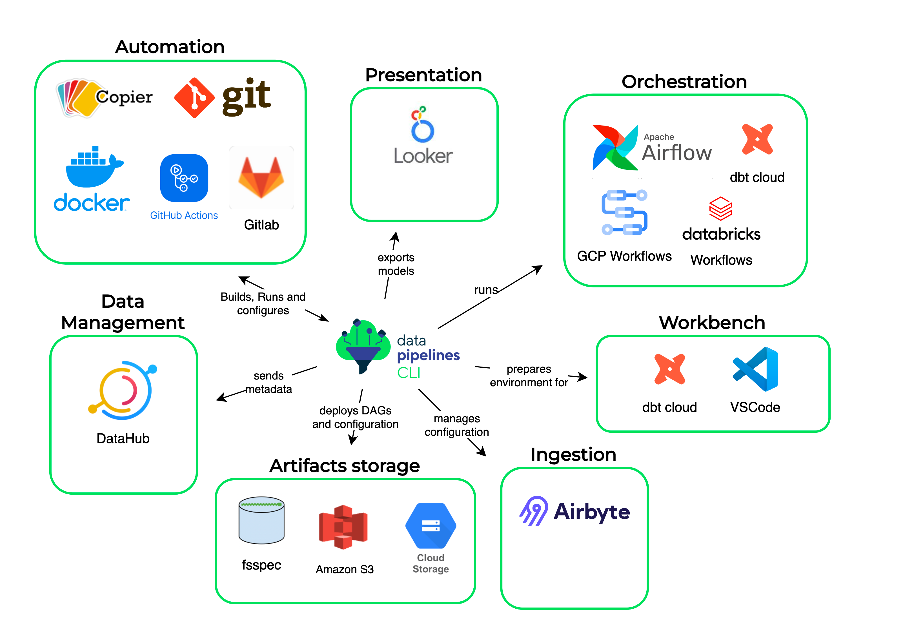
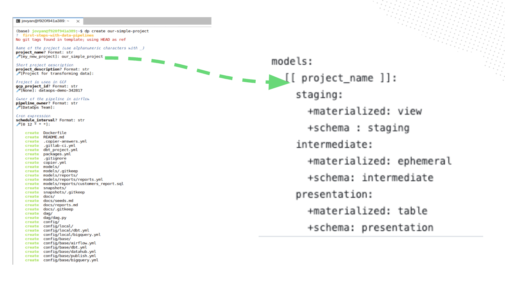
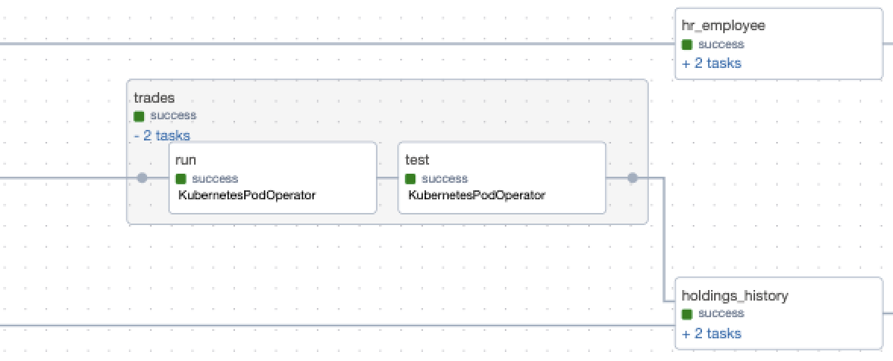
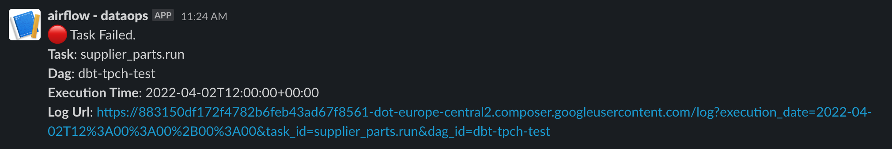

# DP Framework

## About
From low-value inputs into high-value outputs - data value chain describes the full data lifecycle from collection to analysis and usage… and it’s not all about data transformation. 
An open-source dbt-based **DP Framework** has a goal to support the whole process in the spirit of data democratization, in a portable way to many of infrastructure choices and clouds.

Key characteristics of DP Framework:
* Single unified integration layer to stop "reinventing the wheel".
* Readiness for diverse environments - flexibility in component selection to use them interchangeably
* Ability to work on any environment and with any data storage.
* Standardization, simplification and unification across projects (through templating)
* Hides complexity form Analytical Engineers by grouping most of the interactions with a data platform into one user interface

## Components

### data-pipelines-CLI & Project Template Factory

`data-pipelines-CLI`: [Project on GitHub](https://github.com/getindata/data-pipelines-cli) ([documentation](https://data-pipelines-cli.readthedocs.io/en/latest/index.html))

data-pipelines-CLI:
* Building and managing data pipelines
* Interaction with the whole data environment
* Abstraction layer hiding complexity from the end user
* Handling deployments and publications, automation support

Project Template Factory:
* Defining standardized templates for your organization’s data pipelines
* Differentiating config for different environments
* Creating projects out of templates with a handy cookie cutter

### dbt-airflow-factory

`dbt-airflow-factory`: [Project on GitHub](https://github.com/getindata/dbt-airflow-factory/) ([documentation](https://dbt-airflow-factory.readthedocs.io/en/latest/index.html))

* parses dbt manifest files and builds orchestrator (Apache Airflow, GCP Workflows, Databricks Workflows) jobs
* highly customizable, pluggable runtime 
* DAG is built on-the-fly - without materialization
* task grouping, hiding ephemeral models, etc.
* sends DAG failure notification to Slack or Microsoft Teams channel

## Workshops

As GetInData we delivered a number of **workshops** on how to deploy dbt pipelines on production using best engineering practices with **DP Framework**.

* [Data Mass 2023](https://summit.datamass.io/build-reliable-data-pipelines-using-modern-data-stack-in-the-cloud-2023/)
* [BigDataTechWarsaw 2023](https://bigdatatechwarsaw.eu/build-data-pipelines-stack-in-the-cloud/)
* [Data Mass 2022](https://summit.datamass.io/datamass-gdansk-summit-2022-archive/#agenda)
* [BigDataTecWarsaw 2022](https://bigdatatechwarsaw.eu/modern-data-pipelines-with-dbt/)
https://github.com/getindata/gid-mdp-workshop

Short demo of our Modern Data Platform with DP Framework:

## Tutorials
First Steps With DP Framework: [GitHub](https://github.com/getindata/first-steps-with-data-pipelines) 

## Blog posts & whitepapers

List of our publications on data platform architectures leveraging **DP Framework**:

* Modern Data Platform - the what's, why's and how's? Demystifying the buzzword [link](https://getindata.com/blog/modern-data-platform-what-why-how-demystifying-buzzword)

* Announcing the GetInData Modern Data Platform -  a self-service solution for Analytics Engineers [link](https://getindata.com/blog/announcing-getindata-modern-data-platform-self-service-solution-analytics-engineers)

* GetInData Modern Data Platform - features & tools [link](https://getindata.com/blog/getindata-modern-data-platform-features-tools)

* How we built a Modern Data Platform in 4 months for Volt.io, a FinTech scale-up. [link](https://getindata.com/blog/how-we-built-modern-data-platform-for-fintech-scale-up/)

## Presentations

Presentations on various conferences about **DP Framework**: 
* [Providing end-to-end data value chain with open-source dbt-based DP Framework](https://godatafest.com/broadcasts/providing-end-to-end-data-value-chain-open-source-dbt-based-dp-framework/) (GoDataFest, Amsterdam, 2023)
* [Data Platform - a modern one. A new stack that promotes self-service with well-known best DataOps practices](https://bigdatatechwarsaw.eu/agenda-2023/) (Big Data Tech Warsaw, Warsaw, 2023)
* [Data Platform - what does it take to be called a modern one? A new stack with well-known best practices](https://dssconf.pl/en/#agenda-section) (Data Science Summit, Warsaw, 2022)

## Contributions

All the components of DP Framework are open-source. Pull requests are welcome. Please check out detailed contribution instructions on particular project's repository.

## Contact us
[Contact us](https://getindata.com/estimate) & sign up for DP Framework demo! 
